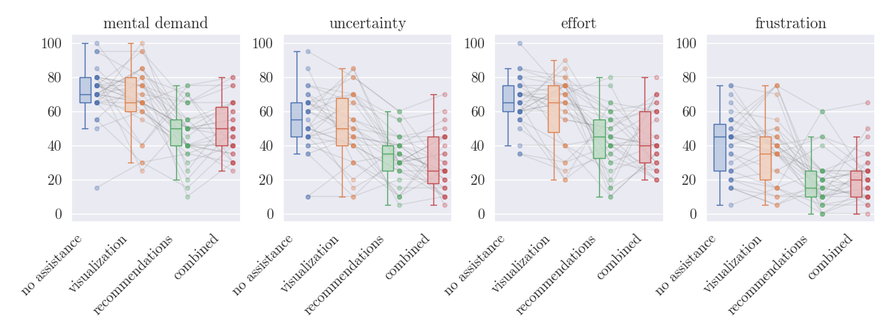
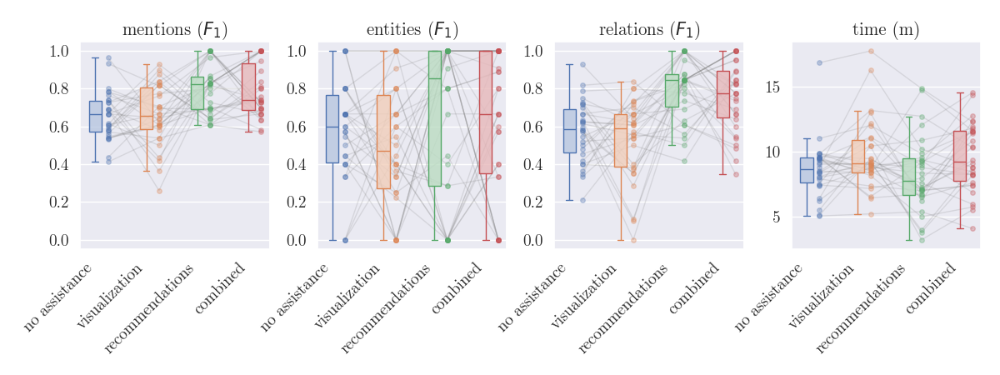
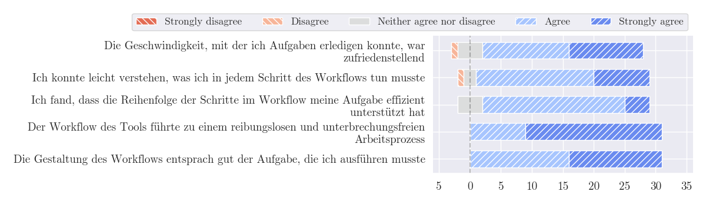
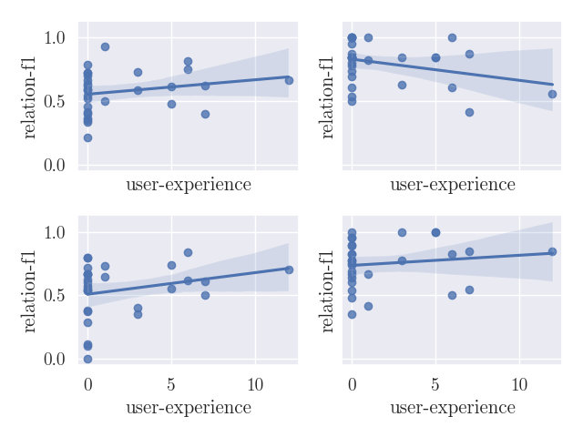

# Assisted Data Annotation for Business Process Information Extraction from Textual Documents



This repository contains the utilities we used in our paper "Assisted Data Annotation for Business Process Information Extraction from Textual Documents", which is to be presented at CoopIS 2024.

## TeaPie Tool Video Demo 

We prepared a video demonstration of how TeaPie can be used.

[Coopis2024Demo.mp4](https://drive.google.com/file/d/1RBY6YDN42sue5i1Vfr5UejQ1C70UIqI5/view)

## Research Prototype Installation

If you are interested in the data annotation prototye we developed you have two options, see below.

If you want to run our visualizations, see [Utility Installation](#utility-installation)

### Docker

If you simply want to run the research prototype, we recommend using Docker. 

__Note__: create a folder, where you want to store the annotation results, here we use a folder in your home system (assuming you are on Linux):

```bash
mkdir $HOME/annotation-results/
```

Then pull and start the services:

```bash


docker pull julianneuberger/annotation-backend
docker pull julianneuberger/annotation-frontend
docker pull julianneuberger/bpmn-layouter-http

docker run -d -p 8011:5000 --mount src=$HOME/annotation-results/,target=/results,type=bind julianneuberger/annotation-backend
docker run -p 8010:8765 -d julianneuberger/bpmn-layouter-http:latest
docker run -d -p 8012:80 julianneuberger/annotation-frontend
```

You can now access the frontend in your browser at http://127.0.0.1:8012

__Note__: This is a research prototype and you can set the level of assistance before you upload a document. Currently the project is not suited for full-scale use in a dataset project, but we are currently working to make this possible.

### From Source

If you are interested in the source code, you can find it for the ...

- Backend Server at https://github.com/JulianNeuberger/annotation-backend
- Visualization Server at https://github.com/JulianNeuberger/pet-to-bpmn-poc/
- Annotation Frontend at https://github.com/JulianNeuberger/annotation-frontend

Please refer to the README in each project for instructions on how to set it up.

## Utility Installation

Tested for python 3.10. To install and run use

```ssh
pip install -r requirements.txt
cd src
python figures.py
```

This will recreate the figures of our paper in data/figures

See below for some examples.

## Supplementary Material

### Raincloud plots for objective measures.


### Qualitative data: Users liked the workflow.

This a small part of our qualitative data, that did not make it into the paper. Look at data/figures/preferences for more.


### User experience may have an effect on some assistance features.

Especially visualizations (bottom left figure). But: Regression plots are not the tool of choice to analyze data like this. See our paper for a better option! 

